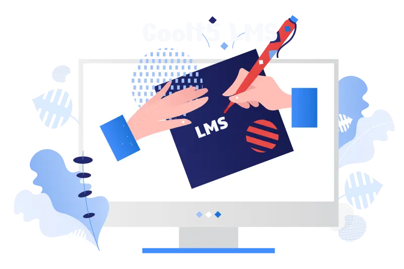

# 📘 LMS 프로젝트

> 온라인 강의 운영을 위한 학습관리시스템(LMS)을 개발합니다. 강사와 학습자는 과정 등록, 시험 제출, 과제 관리, 출결 기능을 통해 효율적인 학습 활동을 할 수 있습니다.

---

## 📌 개요

온라인 학습 환경을 위한 종합 학습관리시스템입니다. 교육생, 강사, 관리자가 각각의 역할에 따라 과정 등록, 시험, 과제, 출석 등 다양한 기능을 활용할 수 있습니다.

---

## 🛠 기술 스택

- **Back-end**: Java 17, Spring Boot, Spring Security  
- **Front-end**: Thymeleaf, JavaScript, Bootstrap  
- **Database**: MariaDB  
- **DevOps**: Gradle, GitHub Actions

---

## ✨ 기능 목록

- ✅ 사용자 로그인 및 회원가입  
- ✅ 강의 등록 및 학생 관리  
- ✅ 시험 출제 및 응시 기능  
- 🔄 관리자 통계 대시보드 개발 중  

---

## 🖼️ 스크린샷

| 로그인 화면                                                  | 시험 응시 화면 |
|---------------------------------------------------------|----------------|
|  |  |

---

## 📁 프로젝트 구조

```bash
📦lms-project
 ┣ 📂src
 ┃ ┣ 📂main
 ┃ ┣ 📂resources
 ┃ ┗ 📂test
 ┣ 📄build.gradle
 ┣ 📄README.md
```

---

## ⚙️ 설치 및 실행 방법

```bash
# 1. 클론
git clone https://github.com/alkali55/lms.git

# 2. 디렉토리 이동
cd lms
# 3. 빌드 및 실행
./gradlew build
./gradlew bootRun
```

---


## 🧩 데이터베이스 정보

- **Database**: MariaDB  
- **ERD**: [📷 ERD 보기](./docs/db/erd.png)  
- **초기 데이터**: `resources/db/init-data.sql`

---

## 🚀 배포 정보

- **환경**: cafe24
- **배포 주소**: 
- **구조도**: 

---

## 🧭 Git 전략 요약

- 브랜치 전략: `main`, `develop`, `feature-*`  
- 커밋 컨벤션: `feat`, `fix`, `docs`, `test`, `chore` 

- 병합 방식: 개인별 rebase squash 완료한 후 push, 이후 관리자 merge and squash
- PR 정책: 최소 1명 리뷰 후 병합, 충돌 처리 책임 명확히

---

## 👥 팀원 및 역할

| 이름 | 역할 | GitHub |
|------|------|--------|
| 류준규 | 팀장 | [@joon](https://github.com/) |
| 김강 | 역할1 | [@khan](https://github.com/) |
| 김영재 | 역할2 | [@jeff](https://github.com/) |
| 김종원 | 역할3 | [@jason](https://github.com/) |
| 박유진 | 역할4 | [@jin](https://github.com/) |
| 여성욱 | 역할5 | [@corner](https://github.com/) |
| 전인수 | 역할6 | [@Edward](https://github.com/alkali55) |

---

## 📚 참고 자료

- [Spring 공식 문서](https://docs.spring.io/spring-boot/docs/current/reference/htmlsingle/)  
- [Swagger 문서](https://swagger.io/specification/)  
- [Thymeleaf Docs](https://www.thymeleaf.org/documentation.html)

---

## 📎 기타 문서

- [ERD](./docs/db/erd.png)  
- [Figma UI 설계](https://figma.com/file/abc123/LMS-Design)  
- [운영 정책 문서](./docs/policy.md)

---